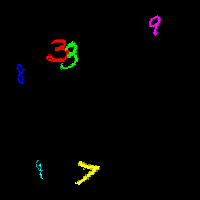

# Flying MNIST Database



This PyTorch dataset class generates a flying colored MNIST dataset and corresponding dense labels.
This dataset has been made for segmentation purposes.

The dataset is generated on the fly with images randomly sampled in the provided input MNIST dataset.
Querying twice the same index will yield the same sample.

Usage:
```python
from torchvision.datasets import MNIST
from torchvision.transforms import ToTensor

from flying_mnist import FlyingMNIST

train_dataset = MNIST(
    root='./data',
    train=True,
    download=True,
    transform=ToTensor()
)

flying_mnist = FlyingMnist(train_dataset, seq_length=10, min_img_num=3, max_img_num=7, img_size=(200, 200), rotation=20)

sample, label = flying_mnist[0]


# Check generated sample by creating a gif:
flying_mnist.tensor2gif(sample, duration=100, save=True)
```